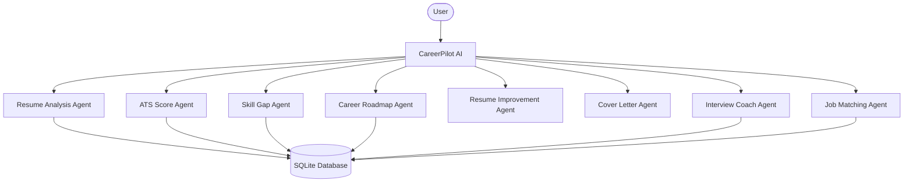

# 🚀 CareerPilot AI

### Multi-Agent AI Career Growth Platform

> An intelligent career optimization platform built for the Google × Kaggle Agentic AI Capstone, powered by a coordinated network of AI agents that help users analyze resumes, improve ATS scores, discover career paths, prepare for interviews, and track job applications.

---

## 🌟 Problem Statement

Job seekers often struggle with:

* Low ATS compatibility scores
* Generic resumes and cover letters
* Lack of personalized career guidance
* Poor interview preparation
* Managing multiple job applications

CareerPilot AI solves these challenges through an integrated multi-agent AI ecosystem.

---

## 🎯 Solution

CareerPilot AI combines multiple specialized AI agents into a unified platform that provides:

✅ Resume Intelligence

✅ ATS Optimization

✅ Skill Gap Analysis

✅ Career Roadmapping

✅ AI-Powered Cover Letters

✅ Mock Interview Coaching

✅ Job Matching

✅ Application Tracking

---

## 🧠 Multi-Agent Architecture



---

# ✨ Key Features

## 📄 Resume Analysis Agent

* Extracts skills, education, experience, and profile summary.
* Generates structured candidate profiles.

## 🎯 ATS Score Agent

* Calculates resume-job compatibility scores.
* Highlights ATS keyword alignment.

## 📊 Skill Gap Analysis Agent

* Identifies missing skills.
* Suggests actionable improvements.

## 🛣 Career Roadmap Agent

* Creates personalized growth plans.
* Recommends milestones and learning paths.

## ✍ Resume Enhancement Agent

* Rewrites bullet points using STAR methodology.
* Improves clarity and impact.

## 📧 Cover Letter Generator

* Creates customized cover letters for target roles.

## 🎤 Interview Coach Agent

* Conducts AI-powered mock interviews.
* Provides detailed performance feedback.

## 🎯 Job Matching Agent

* Computes semantic similarity between resumes and job descriptions.

## 📌 Job Application Tracker

* Manage applications from a centralized dashboard.

---

# 🛠 Tech Stack

### Backend

* Python
* Flask
* SQLite
* JWT Authentication

### AI Layer

* Google Gemini API
* Multi-Agent Architecture
* Prompt Engineering

### Frontend

* HTML
* CSS
* JavaScript
* TypeScript

### Deployment

* Render
* Railway

---

# 📂 Project Structure

```text
CareerPilot-AI
│
├── backend/
│   ├── agents/
│   ├── routes/
│   ├── services/
│   ├── database/
│   └── main.py
│
├── frontend/
│   ├── src/
│   ├── css/
│   ├── js/
│   └── pages/
│
├── sample_resume.docx
├── sample_job_description.txt
└── README.md
```

---

# ⚙️ Installation

### Clone Repository

```bash
git clone https://github.com/kumarnirajsingh114/careerpilot_AI.git
cd careerpilot_AI
```

### Create Virtual Environment

```bash
python -m venv venv
```

### Activate Environment

**Windows**

```bash
venv\Scripts\activate
```

**Linux / macOS**

```bash
source venv/bin/activate
```

### Install Dependencies

```bash
pip install -r requirements.txt
```

### Configure Environment Variables

Create a `.env` file:

```env
GEMINI_API_KEY=YOUR_API_KEY
```

### Run Application

```bash
python main.py
```

Open:

```text
http://localhost:8000
```

---

# 🧪 Sample Testing

Generate sample files:

```bash
python create_sample_files.py
```

Generated files:

* sample_resume.docx
* sample_job_description.txt

Use them to test ATS scoring and resume analysis workflows.

---

# 📈 Future Enhancements

* RAG-based Career Knowledge Assistant
* Real-time Job Scraping
* LinkedIn Profile Optimization
* AI Salary Prediction
* Personalized Learning Recommendations
* Resume Version Management

---

# 🏆 Capstone Highlights

* Multi-Agent AI Architecture
* Production-Oriented Design
* End-to-End Career Growth Workflow
* Modular and Scalable Backend
* Gemini-Powered Intelligence
* Real-World Employability Focus

---

# 👨‍💻 Author

**Niraj Kumar Singh**

Google × Kaggle Agentic AI Capstone Project

Building AI systems that solve real-world career challenges through intelligent automation.

---

⭐ If you found this project useful, consider giving it a star on GitHub.
